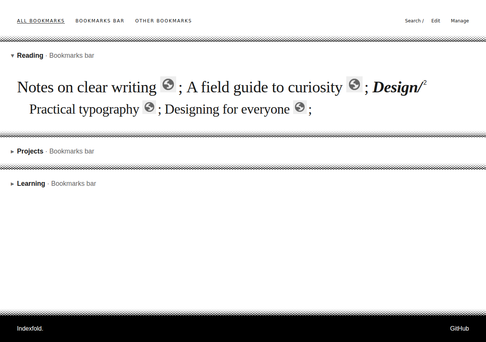

# Indexfold

**Your bookmarks, beautifully within reach.**

A typography-first bookmark dashboard with instant search and keyboard navigation. Built for Chrome and Edge.




*The real dashboard with an illustrative bookmark collection.*

[User guide](docs/user-guide.md) · [Releases](https://github.com/fre3/indexfold/releases) · [Report an issue](https://github.com/fre3/indexfold/issues)

## Why Indexfold?

- **Search as you type.** Start typing to search titles, URLs, folder paths and tags without opening another screen. Use `#tag` and `@folder` to narrow your search.
- **A dashboard worth opening.** Large editorial typography, stacked section cards and quiet controls give your bookmarks room to breathe.
- **Preview before opening.** Hover a section to peek inside; long previews gently scroll after a delay. Automatic scrolling can be disabled and respects reduced motion.
- **Keyboard first.** Open dashboard search with a configurable browser shortcut, switch roots with Alt+1–9, and press Escape to return to your previous browsing context.
- **Your actual browser bookmarks.** Create, edit, move and delete bookmarks and folders. Indexfold works with the browser's existing hierarchy and order.
- **Tags that follow the structure.** Folder tags are inherited by descendants without being copied onto them. Moving an item changes its inherited context.
- **Archive without deleting.** Archive a bookmark or an entire folder subtree; show it again with the local Show archived setting.
- **Editing by mouse or keyboard.** Use Edit mode, drag titles to move items, or choose More → Move for a keyboard-accessible alternative.
- **Light, dark or system appearance.** Theme and other viewing preferences are stored locally.
- **Limited permissions.** No broad website-access permission is requested. Bookmark access supports management, storage supports metadata/preferences, and tab access supports finding and reusing the dashboard for its search shortcut.

Search runs locally; no search backend is required. “Instant” describes the interaction, not a claim of identical performance on every device or bookmark collection.

## Privacy and permissions

Indexfold keeps titles, URLs, folder hierarchy and order in the browser's native bookmark system. It stores tags and identity metadata separately using browser extension storage.

The v1.0.0 manifest requests:

| Permission | Purpose |
| --- | --- |
| `bookmarks` | Read and manage your native bookmarks and folders. |
| `storage` | Save tags and identity metadata in extension sync storage, and device preferences locally. |
| `favicon` | Read browser-provided favicons through the extension-local favicon endpoint. |
| `tabs` | Identify and reuse dashboard tabs for the configurable search command. |

The `tabs` permission exposes tab URL/title metadata; Indexfold uses it to identify its dashboard for command routing.

The manifest declares no content scripts or host permissions. Application code has no website-content fetching, analytics endpoint or search backend. Favicons may still involve browser/network requests; Indexfold is not described as network-free. Browser account synchronization may transmit bookmarks and extension metadata through the browser provider.

Deletion affects real bookmarks, including descendants when deleting a folder. Confirmations and identity checks reduce accidental changes, but they do not replace a backup. Diagnostic exports can contain private bookmark information: inspect them before sharing.

## Install the release

[Download v1.0.0](https://github.com/fre3/indexfold/releases/tag/v1.0.0). Use a current Chrome or Edge version.

1. Download the **unpacked extension ZIP** from [GitHub Releases](https://github.com/fre3/indexfold/releases). Choose the extension asset, not GitHub's source-code ZIP.
2. Extract it into a permanent local folder.
3. Open the appropriate browser page:

   | Chrome | Edge |
   | --- | --- |
   | `chrome://extensions` | `edge://extensions` |

4. Enable **Developer mode**, choose **Load unpacked**, and select the extracted folder containing `manifest.json`.
5. Open a new tab. If your browser asks whether to keep the new-tab change, keep Indexfold enabled.
6. Configure its dashboard-search command at `chrome://extensions/shortcuts` or `edge://extensions/shortcuts`.

If another extension also replaces the New Tab page, choose which one should own that page. Keep the extracted folder: an unpacked installation loads its files from there.

GitHub installation is separate from Chrome Web Store or Edge Add-ons distribution. No store listing is implied.

Official loading instructions: [Chrome](https://developer.chrome.com/docs/extensions/get-started/tutorial/hello-world#load-an-unpacked-extension) · [Edge](https://learn.microsoft.com/en-us/microsoft-edge/extensions/getting-started/extension-sideloading).

## Build from source

Install Git and **Node.js 24 or later** with npm. For the published v1.0 source:

```sh
git clone https://github.com/fre3/indexfold.git
cd indexfold
git checkout v1.0.0
npm ci
npm run check
```

To work on the repository's current default branch instead, omit the checkout command.

`npm run check` runs typechecking, lint, tests and the production build. The complete unpacked extension is generated in **`dist/`**. Load that directory using the installation steps above.

Useful development commands:

```sh
npm run build
npm run dev
npm run extension:id
```

`npm run dev` watches and rebuilds the extension; it does not start a hosted bookmark dashboard. After changing an installed build, reload the extension and open a fresh new tab.

`dist/` is intentionally tracked. Preserve the manifest's public identity key and persistent storage identifiers so existing installations keep their metadata identity.

## Updates and synchronization

To update an unpacked installation, replace its files with the next release in the same folder, reload it on the extensions page, and open a fresh new tab. Avoid uninstalling/reinstalling solely to update.

Native bookmark synchronization depends on your browser's account and sync settings. Tags use extension sync storage. Install the same Indexfold extension identity on each device; a pending folder review may require confirmation before folder tags appear.

Two-device Edge workflows, including folder tags and cross-Workspace moves, have been manually verified. This is not a promise of immediate delivery, conflict-free simultaneous editing, or automatic synchronization between Chrome and Edge.

Appearance, Show archived and preview-scroll preferences are local to each device. Folder associations are confirmed locally, never guessed from duplicate names. Native changes and extension metadata are separate writes: a partial-save message identifies what succeeded, preserves remaining input and allows safe completion. Do not retry an uncertain move blindly.

## Edge Workspaces

Existing immediate folders under Edge's Workspaces root are treated as Workspace containers. Create and manage the Workspaces themselves through Edge. Indexfold protects those containers while allowing normal bookmark/subfolder operations inside them, including moves between containers.

The active Edge Workspace is not automatically detected. Moves between a Workspace and ordinary bookmark roots remain restricted.

## Help and development

Read the [user guide](docs/user-guide.md) for the daily workflow, shortcuts, tags and archiving.

For developers: [architecture](docs/architecture.md), [current handoff](docs/development-state.md) and [roadmap](docs/roadmap.md). Developer documents describe implementation and historical evidence; they are not required for everyday use.

When reporting an issue, include your browser version, Indexfold version and steps to reproduce. Use synthetic examples where possible; share diagnostic exports only after reviewing their contents.
