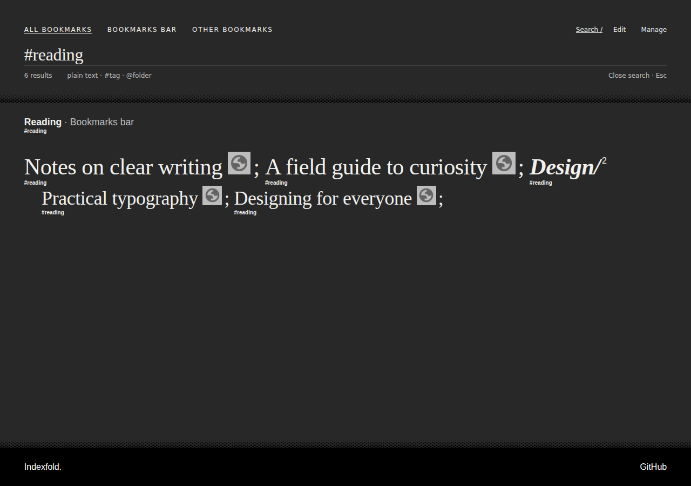
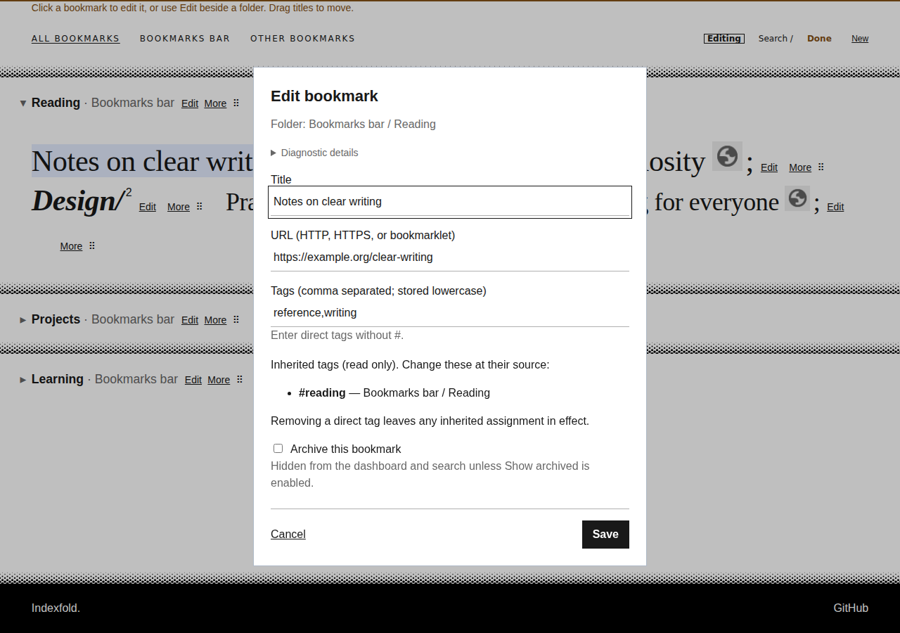

# Using Indexfold

**Your bookmarks, beautifully within reach.**

Indexfold turns your browser's New Tab page into a searchable bookmark dashboard. Your existing folders and bookmarks remain the source of truth.

## A good everyday workflow

1. Open a new tab.
2. Focus the dashboard (in Edge, Ctrl+F6 moves focus from the address bar), then type a word from the bookmark's title, URL, folder or tags.
3. Open the matching bookmark.
4. Press Escape when you want to return to the view you were browsing before search.

Use **All bookmarks** when you are unsure where something lives. Choose a root such as Bookmarks bar or Favorites bar when you want to browse a smaller collection. Indexfold preserves the actual names supplied by your browser.

For a useful structure, keep a handful of broad folders—such as Reading, Projects and Learning—and use tags for themes that cross folder boundaries.

## Browse, peek and open

Hover a section heading to preview its contents. A long preview starts scrolling after about one second. Moving away resets it; clicking opens the section normally at its beginning.

Click a section to open or close it. The heading's chevron distinguishes an open section from a temporary peek. Click nested folders to browse deeper; their trailing slash and small count distinguish them from bookmarks.

Tags normally appear on hover or keyboard focus. Folder-derived tags are bold. The “Next:” summary identifies section headings concealed by a peek.

Automatic preview scrolling can be disabled in **Manage → Settings**. Keyboard-only previews remain static, and reduced-motion preferences disable automatic scrolling.

## Search precisely

Start typing in the dashboard, press `/`, or use Search.

| Type | Searches | Example |
| --- | --- | --- |
| Ordinary text | Titles, URLs, folder paths and tags | `design` |
| `#` followed by text | Effective tags, including inherited tags | `#reading` |
| `@` followed by text | Folder paths | `@projects` |
| Several terms | Items matching all the terms | `design @projects #reading` |

Matching is case-insensitive. Use a few distinctive words rather than copying a complete title.

Search normally uses the current root. Invoking the extension's search shortcut from another page temporarily searches **All bookmarks**. Escape restores the earlier root, expansion and scroll position.

Changing roots during search retains the query. Escape still returns to the original browsing context.

*Search keeps section and folder context, without repeating full paths beside each result.*

## Keyboard shortcuts

| Action | Shortcut |
| --- | --- |
| Start dashboard search | Type, or press `/` |
| Open/reuse dashboard search from elsewhere | Configurable browser extension command |
| Choose a root | `Alt+1` through `Alt+9`, in displayed navigation order |
| Navigate controls | `Tab` / `Shift+Tab` |
| Activate a focused control | `Enter`, respecting native field behavior |
| Leave search | `Escape` |
| Cancel editing | `Escape`; changed drafts require confirmation |

On Windows, the suggested dashboard-search command is **Ctrl+Shift+B**. Check its actual assignment at `chrome://extensions/shortcuts` or `edge://extensions/shortcuts`; you can change or remove it. Assigning that combination may replace the browser's bookmark-bar shortcut.

Try **Ctrl+T → configured search shortcut → type**, using Ctrl+F6 if Edge keeps focus in the address bar. Ctrl+T alone continues to leave focus in the address bar.

Alt+1 selects All bookmarks; later numbers select the available roots. Use the **top number row**: Windows Alt+numpad combinations may enter symbols. Plain numbers remain searchable text.

If an already-open Edge dashboard enters search while focus stays in the address bar, press **Ctrl+F6** to move focus into the page.

## Create, edit and move

Choose **Edit** to enter Editing mode. Choose **Done** to return to ordinary browsing.

- Click a bookmark title or its Edit action to open its editor.
- For a section or nested folder, use Edit beside the title; clicking its title still expands/collapses it.
- Use **New** or a folder's **More → New bookmark / New folder** to create items. Check the destination before saving.
- Drag a title to move or reorder it. The moving preview and drop marker show the intended result.
- For keyboard movement, use **More → Move**, choose the destination and placement, then confirm. Start and End are the first placement choices.
- Search results use Move rather than positional dragging.
- **More → Delete** asks for confirmation. Deleting a folder also deletes its descendants.

Bookmark titles open editors in Editing mode. Use their native right-click menu, or Shift+F10, when you deliberately want to open the link instead.

Save applies changes to your actual browser bookmarks. Cancel dismisses unsaved input; it cannot undo a native change that already succeeded during a partial save. If a save reports partial success, follow its recovery message to complete the remaining metadata rather than creating the item again. Unchanged or reverted forms close without a discard prompt. If you have changed a draft, Escape opens a confirmation; Escape again returns to editing and preserves the draft.

Read-only fields cannot be changed. Browser-owned containers are protected even when their tags remain editable.

*Inherited tags are read-only; edit them at their source folder.*

## Tags and inheritance

Enter direct tags separated by commas, without `#`. Use `#` when searching or reading tag labels; tag values are normalized to lowercase.

A folder tag applies to all descendants as an **inherited tag**. It is not copied into each descendant's direct tags.

For example:

- Tag the Reading folder `reading`.
- Tag a bookmark inside it `design`.
- That bookmark matches both `#reading` and `#design`.

Editors distinguish direct tags from inherited tags and show their sources. Edit the ancestor folder to change an inherited tag. Moving an item changes its inherited tags automatically.

## Archive instead of delete

Use the archive checkbox in an editor to hide a bookmark or a folder and its descendants from the dashboard and search, including Editing mode.

To see archived items, enable **Manage → Settings → Show archived**. You can then edit the source item and remove its direct archive status. A descendant still archived through an ancestor stays archived until that ancestor is changed.

Show archived is local: one device can display archived items while another hides them.

## Use Indexfold on another device

Enable your browser's bookmark/account synchronization and install the same Indexfold extension identity on both devices.

Bookmarks synchronize through the browser; tags use extension sync storage. Folder tags may need an identity confirmation on a new device. If Indexfold shows a pending folder review, choose **Review**, check the proposed folder and confirm the correct match. This is available even when the folder is archived.

Allow time for synchronization. Avoid simultaneous edits to the same tags on different devices. Chrome and Edge accounts do not become one shared synchronization service through Indexfold.

Deleting removes native bookmarks and can propagate through browser sync; it is not archiving and Indexfold offers no Undo. Use disposable items when learning the editing controls. Draft protection does not guarantee recovery after closing or reloading the tab.

## Settings and help

**Manage** separates three areas:

- **Settings:** appearance, archived visibility, preview scrolling and shortcut information.
- **Bookmarks:** management and folder-binding review.
- **Diagnostics:** version, health and evidence for troubleshooting.

In Edge, existing folders directly under Workspaces are treated as Workspace containers. Create/rename/delete those containers through Edge; manage their bookmarks and subfolders in Indexfold. The dashboard shows all containers rather than automatically detecting the active Workspace. Moving ordinary items between Workspace containers is supported; moving between a Workspace and an ordinary bookmark root remains restricted. Nothing can be created or moved directly beneath the Workspaces root. Loose entries there remain available in search and Manage.

A diagnostic export can contain private titles, URLs, folder paths, tags or bookmarklet code. Review it before sharing. It is not a bookmark backup. Use your browser's bookmark export for a native bookmark backup.

[Installation and build instructions](../README.md) · [Report an issue](https://github.com/fre3/indexfold/issues)
